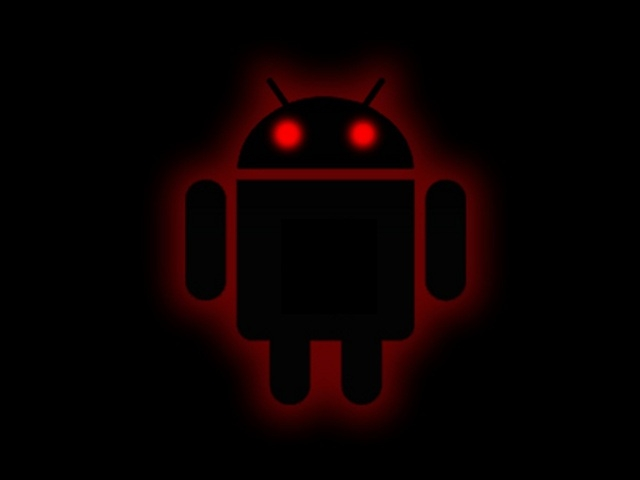

# Welcome to AndKaiju

## Origin

AndKaiju comes from two words, Android and Kaiju. Android is obviously for the Android operating system. Kaiju (怪獣, kaijū, from Japanese "strange beast") is a Japanese genre of films featuring giant monsters. The term kaiju (which comes from the Chinese text Classic of Mountains and Seas) can refer to the giant monsters themselves, which are usually depicted attacking major cities and engaging the military, or other kaiju, in battle. The kaiju genre is a subgenre of tokusatsu (特撮, "special filming") entertainment.

## About AndKaiju

AndKaiju is used to pull Android applications (apk) off of a phone and save it to a computer it is connected to. One of the many reasons you may want to do this is if you have two phones. One phone has Google Play Services and the Google Play Store that can download updates and get "all" the apps. While on the second phone, you're running a ROM, like [GrapheneOS](https://grapheneos.org/) or [LineageOS](https://lineageos.org/) without Google Services/Products installed. You can now "*steal*" the application from the "Google-fied" phone and install it on a more privacy oriented phone.

!!! warning
    Applications that require Google Play Services will not function on a phone that does not have Google Play Services install.